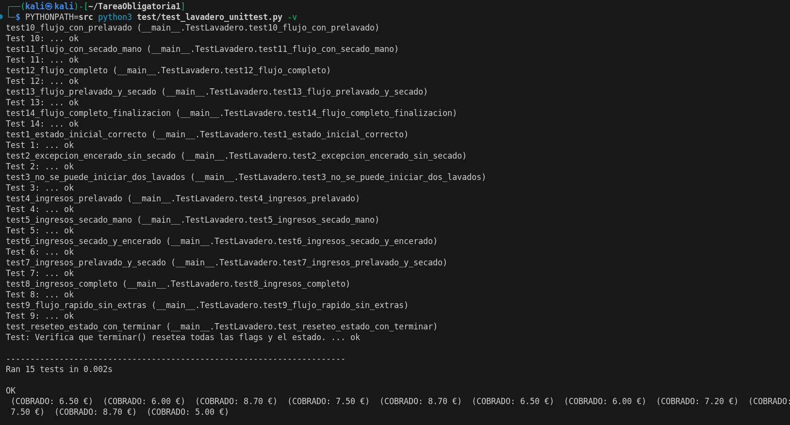

# PPS – Unidad 1 – Tarea RA1  
## Simulación de un Lavadero de Coches

Proyecto desarrollado para la asignatura **Programación de Propósito General
(PPS)**. Consiste en la simulación de un lavadero de coches con distintas fases,
opciones de lavado y un conjunto de pruebas unitarias.

---

## Estructura del proyecto

```
├── src/
│ └── lavadero.py
├── test/
│ └── test_lavadero.py
├── docs/
│ └── index.md
├── mkdocs.yml
├── requirements.txt
└── README.md
```
---

## Elementos de Python

El archivo `src/lavadero.py` contiene la clase `Lavadero`, que simula el
funcionamiento de un túnel de lavado mediante una máquina de estados.

Se utilizan:
- Atributos privados (`__fase`, `__ocupado`, etc.)
- Constantes para representar las fases
- Métodos para avanzar de fase y aplicar reglas de negocio
- Propiedades (`@property`) para acceso controlado al estado

También se incluye un método auxiliar `ejecutar_y_obtener_fases()` para facilitar
las pruebas unitarias.

---

## Ejecución y Depuración

Durante el desarrollo se corrigieron errores relacionados con:
- Acceso incorrecto a atributos privados
- Gestión del estado del lavadero
- Transiciones de fase incorrectas

Las soluciones consistieron en mejorar la encapsulación y ajustar la lógica del
método `avanzarFase()`.



---

## Pruebas

Las pruebas se encuentran en la carpeta `test/` y verifican:
- Flujos completos de lavado
- Reglas de negocio
- Secuencia correcta de fases
- Correcta finalización del lavado

Ejecución de pruebas:

```bash
PYTHONPATH=src python -m unittest discover -v
``` 
